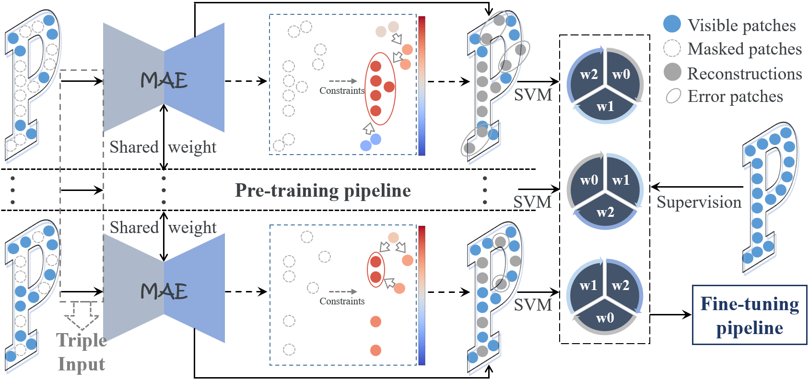
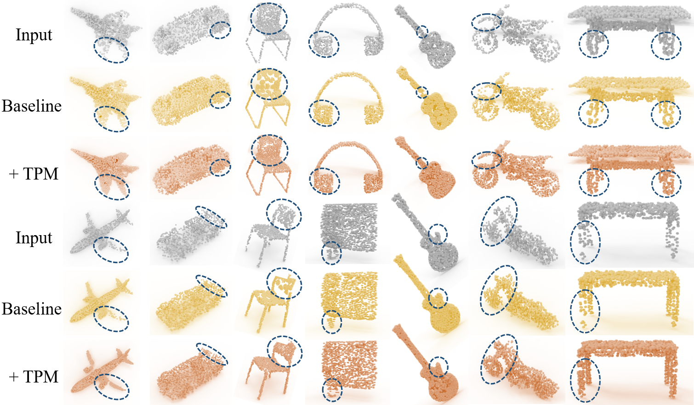
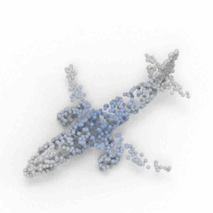
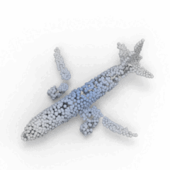
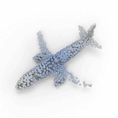

<div align="center">
<h1>Triple Pont Masking</h1>


[Jiaming Liu](https://scholar.google.com/citations?user=eQERdsAAAAAJ)<sup>1</sup>, [Linghe Kong](https://www.cs.sjtu.edu.cn/~linghe.kong/)<sup>1</sup>, [Yue Wu](https://ywuchina.github.io/)<sup>2✉</sup>, [Maoguo Gong](https://scholar.google.com/citations?user=D-TS1fAAAAAJ)<sup>2</sup> ,[Hao Li](https://scholar.google.com/citations?user=JkQmO-kAAAAJ)<sup>2</sup>, [Qiguang Miao](https://scholar.google.com/citations?user=2TQfvt8AAAAJ)<sup>2</sup>, [Wenping Ma](https://scholar.google.com/citations?user=I1pPv1QAAAAJ)<sup>2</sup>, [Can Qin](https://canqin.tech/)<sup>3</sup>

<sup>1</sup>  Shanghai Jiao Tong University · <sup>2</sup>  Xidian University · <sup>3</sup>  Salesforce AI Research

(​✉️​) Corresponding author

[](https://arxiv.org/pdf/2409.17547)

</div>

## Abstract

Existing 3D mask learning methods encounter performance bottlenecks under limited data, and our objective is to overcome this limitation. In this paper, we introduce a <u>**T**</u>riple <u>**P**</u>oint <u>**M**</u>asking scheme, named TPM, which serves as a scalable plug-and-play framework for MAE pre-training to achieve multi-mask learning for 3D point clouds. Specifically, we augment the baseline methods with two additional mask choices (i.e., medium mask and low mask) as our core insight is that the recovery process of an object can manifest in diverse ways. Previous high-masking schemes focus on capturing the global representation information but lack fine-grained recovery capabilities, so that the generated pre-training weights tend to play a limited role in the finetuning process. With the support of the proposed TPM, current methods can exhibit more flexible and accurate completion capabilities, enabling the potential autoencoder in the pre-training stage to consider multiple representations of a single 3D object. In addition, during the fine-tuning stage, an SVM-guided weight selection module is proposed to fill the encoder parameters for downstream networks with the optimal weight, maximizing linear accuracy and facilitating the acquisition of intricate representations for new objects. Extensive experiments show that the five baselines equipped with the proposed TPM achieve comprehensive performance improvements on various downstream tasks. 

## Overview

<div  align="center">    
 
</div>

## Getting Started

### Installation

Please refer to the baselines to set up the installation environment. [Point-MAE](https://github.com/Pang-Yatian/Point-MAE) is recommended:
```shell
# Install basic required packages
(dapt) $ pip install -r requirements.txt

# PointNet++
(dapt) $ pip install "git+https://github.com/erikwijmans/Pointnet2_PyTorch.git#egg=pointnet2_ops&subdirectory=pointnet2_ops_lib"

# GPU kNN
(dapt) $ pip install --upgrade https://github.com/unlimblue/KNN_CUDA/releases/download/0.2/KNN_CUDA-0.2-py3-none-any.whl
```

### Datasets

* For [Point-MAE](https://github.com/Pang-Yatian/Point-MAE), [Point-M2AE](https://github.com/ZrrSkywalker/Point-M2AE) and [PointGPT-S](https://github.com/CGuangyan-BIT/PointGPT), please see [DATASET.md](./DATASET.md) for details.

* For [Inter-MAE](https://github.com/ywuchina/TeamCode/tree/liujia99/Inter-MAE), please download ShapeNetRender dataset from [here](https://drive.google.com/file/d/1F9XIhF1qngLt-GtdnOnXiTsXH84YtrbC/view?usp=drive_link).

* For [PointGPT-B](https://github.com/CGuangyan-BIT/PointGPT), please download both unlabeled hybrid dataset and labeled hybrid dataset from [here](https://drive.google.com/file/d/1TWgd3eJX1HDruFfU9JrGnBfcVhzJIXqT/view?usp=sharing).

### Pre-training

First go to the folder of the baseline method and then execute the pre-training command. For example, Point-MAE:

```
cd Point-MAE

CUDA_VISIBLE_DEVICES=<GPU> python main.py --config cfgs/pretrain-tpm.yaml --exp_name <output_file_name>
```

## Fine-tuning on downstream tasks

###  ModelNet40

```shell
CUDA_VISIBLE_DEVICES=<GPU> python main.py --config cfgs/finetune_modelnet.yaml --ckpts <path/to/pre-trained/model> --finetune_model --exp_name <name>

# 8k input
CUDA_VISIBLE_DEVICES=<GPU> python main.py --config cfgs/finetune_modelnet_8k.yaml --ckpts <path/to/pre-trained/model> --finetune_model --exp_name <name>

# voting
CUDA_VISIBLE_DEVICES=<GPU> python main.py --config cfgs/finetune_modelnet.yaml --test --vote --exp_name <name> --ckpts <path/to/best/model>
```

### ScanObjectNN

```shell
# Fine-tuning on OBJ-BG variant
CUDA_VISIBLE_DEVICES=<GPU> python main.py --config cfgs/finetune_scan_objbg.yaml --ckpts <path/to/pre-trained/model> --finetune_model --exp_name <name>

# Fine-tuning on OBJ-ONLY variant
CUDA_VISIBLE_DEVICES=<GPU> python main.py --config cfgs/finetune_scan_objonly.yaml --ckpts <path/to/pre-trained/model> --finetune_model --exp_name <name>

# Fine-tuning on PB-T50-RS variant
CUDA_VISIBLE_DEVICES=<GPU> python main.py --config cfgs/finetune_scan_hardest.yaml --ckpts <path/to/pre-trained/model> --finetune_model --exp_name <name>
```

## Visualization
Visulization of pre-trained model on validation set, please run:

```
python main_vis.py --test --ckpts <path/to/pre-trained/model> --config cfgs/<MODEL_NAME>/pretrain.yaml --exp_name <name>
```

<div  align="center">    
 
</div>

<br> In addition, after converting the ```.ply``` file to a ```.obj``` file, we use **KeyShot** to render 3D point clouds to reflect the completion effect with the help of TPM.

| Input              | Point-MAE        | Point-MAT with TPM  |
| ------------------------------ | ---------------------------- | ---------------------------- |
|  |  |  |

## Acknowledgements

This project is based on Point-MAE ([paper](https://arxiv.org/abs/2203.06604), [code](https://github.com/Pang-Yatian/Point-MAE)), Point-M2AE ([paper](https://proceedings.neurips.cc/paper_files/paper/2022/file/ad1d7a4df30a9c0c46b387815a774a84-Paper-Conference.pdf), [code](https://github.com/ZrrSkywalker/Point-M2AE)), Inter-MAE ([paper](https://ieeexplore.ieee.org/abstract/document/10262210), [code](https://github.com/ywuchina/TeamCode/tree/liujia99/Inter-MAE)), PointGPT ([paper](https://proceedings.neurips.cc/paper_files/paper/2023/file/5ed5c3c846f684a54975ad7a2525199f-Paper-Conference.pdf), [code](https://github.com/CGuangyan-BIT/PointGPT)). Thanks for their wonderful works.
